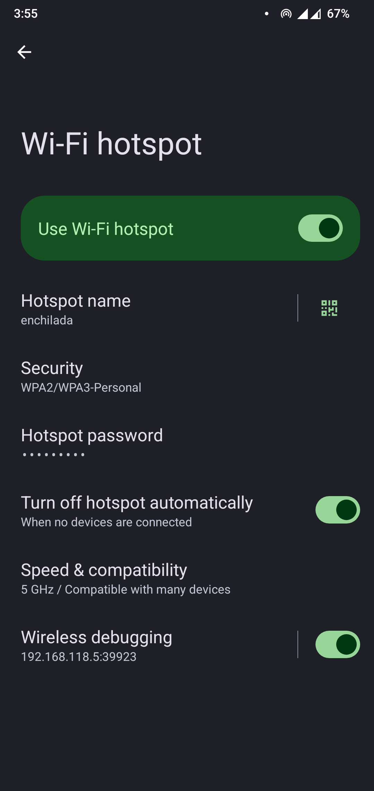

# Hotspot Wireless Debugging

LSPosed module that allows Wireless Debugging (ADB over Wi-Fi / TLS pairing) to work over
Wi-Fi Hotspot on Android 15 and Android 16.

Android 11+ only enables Wireless Debugging when the device is connected to Wi-Fi as a client.
This module hooks the Settings app and system framework to bypass that restriction, so hotspot
guests can connect via ADB while the device acts as a SoftAP / hotspot.

## Requirements

| Item | Requirement |
|------|-------------|
| Android | **16** (primary target, Pixel 9a / `tegu`); Android 15 also supported |
| Framework | **LSPosed** (Vector or other modern API 101-compatible fork) |
| Xposed API | Modern libxposed **API 101** — legacy XposedBridge not supported |

> **Note**: This module targets the modern libxposed API 101.  It will **not** load on older
> frameworks that only support the legacy `de.robv.android.xposed` API.  You need a current
> LSPosed build (Vector era or equivalent).

## Installation

Grab the latest APK from [GitHub Actions](https://github.com/cbkii/hotspotadb/actions)
artifacts, or [build from source](#building-from-source).

1. Install the APK
2. Enable the module in LSPosed for both scopes:
   - `com.android.settings`
   - `android` (System Framework)
3. Reboot

## Usage

1. Enable Wi-Fi Hotspot
2. Use the Wireless Debugging toggle on the hotspot settings screen, or go to
   Developer Options > Wireless Debugging
3. Pair your client device: `adb pair <ip>:<pairing_port> <pairing_code>`
4. Connect: `adb connect <ip>:<port>`

On first use, Android prompts to trust a network matching your hotspot name.  Renaming the
hotspot will reset this trust.  The MAC address used in the synthetic `AdbConnectionInfo` is
hardcoded (`02:00:00:00:00:00`) because Android randomises the hotspot MAC on each enable, which
would reset trust every time.

## Architecture

The module has two hook domains:

### `com.android.settings` scope
- `WirelessDebuggingPreferenceController.isWifiConnected(Context)` — returns `true` when
  hotspot is active, so the Wireless Debugging UI stays usable
- `AdbIpAddressPreferenceController.getIpv4Address()` — returns the hotspot AP IP instead of
  the station Wi-Fi IP when hotspot is active
- `WifiTetherSettings.onStart()` — injects a Wireless Debugging toggle directly into the
  hotspot settings screen

### `android` scope (system_server)
- `AdbDebuggingHandler.getCurrentWifiApInfo()` — synthesises an `AdbConnectionInfo` when
  hotspot is active but no station Wi-Fi is present
- ADB Wi-Fi network monitor / `BroadcastReceiver.onReceive()` — suppresses
  `WIFI_STATE_CHANGED` and `NETWORK_STATE_CHANGED` events that would otherwise cause the
  ADB daemon to tear down wireless debugging when the device is not a Wi-Fi client

### Android 16 compatibility
- **AdbConnectionInfo**: tries top-level `com.android.server.adb.AdbConnectionInfo` (Android 16
  refactoring) first, falls back to nested `AdbDebuggingManager$AdbConnectionInfo` (Android 15)
- **Network monitor**: tries named classes (`AdbBroadcastReceiver`, `AdbNetworkMonitor`,
  `AdbWifiNetworkMonitor`) first, then falls back to anonymous inner class scan (Android 15),
  and finally to a `Settings.Global.putInt` intercept as a last resort

## Building from source

Requires JDK 21 and Android SDK with API 36.

```shell
make build     # build debug APK
make install   # install via Gradle
make clean     # clean build artifacts
```

## Known limitations / runtime verification needed

- `AdbDebuggingHandler.getCurrentWifiApInfo()` signature and the exact shape of
  `AdbConnectionInfo`'s constructor on Android 16 QPR2+ are confirmed from AOSP source but
  require on-device validation on a final build.
- The named ADB monitor classes (`AdbBroadcastReceiver`, etc.) are speculative for Android 16;
  the fallback to anonymous inner class scanning will activate if they are absent.
- Settings UI class paths (`WirelessDebuggingPreferenceController`, `WifiTetherSettings`) may
  differ on OEM builds.

## Other solutions

[Magisk-WiFiADB](https://github.com/mrh929/magisk-wifiadb) — Magisk module, enables legacy
`adb tcpip` on boot.  Simpler (just Magisk, any Android), but unencrypted and not
hotspot-aware.  This module hooks native Wireless Debugging (TLS, pairing) with Settings UI,
but needs LSPosed and Android 15+.

## License

[GPL-3.0](LICENSE)
